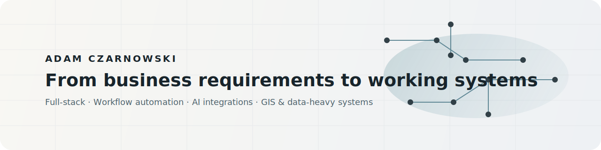

  

<h1 align="center">Hi, I'm Adam! 👋</h1>

  I build practical software across backend, frontend, data, and AI integrations, turning complex business requirements into systems that work in real environments.

  My work sits at the intersection of business needs and technical execution, with a strong focus on reliability, workflow improvement, and reducing manual work.

  

  
<strong>📌 Selected Work</strong>

   
  <h3>Public projects 🌐</h3>

  <blockquote>
    

      
<strong>claude-code-clipboard</strong>

      <blockquote>
        

          A Claude clipboard automation tool that extracts fenced code blocks from responses and copies them directly to the clipboard, with a focus on simplicity, usefulness, and saving time in everyday developer workflows.
        

      </blockquote>
    

  </blockquote>

  <blockquote>
    

      
<strong>fuzzymarks</strong>

      <blockquote>
        

          A browser extension that replaces the default New Tab page with a tree-based bookmark view and fuzzy search, making large bookmark collections easier to navigate while freeing up screen space.
        

      </blockquote>
    

  </blockquote>

  <h3>Private / commercial work 💼</h3>

  <blockquote>
    

      
<strong>Attendance platform</strong>

      <blockquote>
        

          Built and evolved an internal attendance system used across the company, covering backend APIs, frontend flows, authentication, admin features, reporting, and business workflow support.
        

      </blockquote>
    

  </blockquote>

  <blockquote>
    

      
<strong>Reporting and GIS platform</strong>

      <blockquote>
        

          End-to-end work on a reporting platform for a government institution, combining domain-specific workflows, public reporting, and a technical stack built around Django, PostgreSQL/PostGIS, and GeoServer.
        

      </blockquote>
    

  </blockquote>

  <blockquote>
    

      
<strong>AI-assisted citizen service platform</strong>

      <blockquote>
        

          Worked on backend APIs, data flows, architecture, database operations, and optimization for a platform supporting citizen-facing services through AI integrations and reliable backend systems.
        

      </blockquote>
    

  </blockquote>

  <blockquote>
    

      
<strong>Data processing and analysis workflows</strong>

      <blockquote>
        

          Built automation for document extraction, validation, comparison, and Excel/JSON-heavy business processing, helping public-sector users process documents faster and reduce manual work in administrative workflows.
        

      </blockquote>
    

  </blockquote>

  
<strong>🛠️ What I Work With</strong>

   

  <table align="center">
    <tr>
      <th>Area</th>
      <th>Focus</th>
    </tr>
    <tr>
      <td>Backend</td>
      <td>Internal platforms, APIs, and production business logic</td>
    </tr>
    <tr>
      <td>Frontend</td>
      <td>User-facing interfaces, application flows, and product experience</td>
    </tr>
    <tr>
      <td>Data</td>
      <td>Data processing, validation, analysis, and workflow-driven business operations</td>
    </tr>
    <tr>
      <td>Automation</td>
      <td>Workflow automation and process efficiency</td>
    </tr>
    <tr>
      <td>GIS</td>
      <td>Spatial systems and domain-specific business applications</td>
    </tr>
    <tr>
      <td>AI</td>
      <td>AI-assisted products and practical integrations</td>
    </tr>
    <tr>
      <td>Operations</td>
      <td>Monitoring, reliability, and operational visibility</td>
    </tr>
  </table>

  
<strong>⚙️ Tech Stack</strong>

   
  <table align="center">
    <tr>
      <td valign="top" width="50%">
        <strong>Backend</strong> 
        Python · FastAPI · Django
      </td>
      <td valign="top" width="50%">
        <strong>Frontend</strong> 
        React · TypeScript
      </td>
    </tr>
    <tr>
      <td valign="top">
        <strong>Data &amp; DB</strong> 
        PostgreSQL · SQLAlchemy · Alembic · PostGIS
      </td>
      <td valign="top">
        <strong>Infra</strong> 
        Docker · Docker Compose · Nginx
      </td>
    </tr>
    <tr>
      <td valign="top">
        <strong>Background processing</strong> 
        Redis · Celery
      </td>
      <td valign="top">
        <strong>Observability</strong> 
        Grafana · Loki · Sentry
      </td>
    </tr>
    <tr>
      <td valign="top">
        <strong>AI integrations</strong> 
        Claude · CODEX · GEMINI · Google STT/TTS
      </td>
      <td valign="top">
        <strong>GIS &amp; spatial data</strong> 
        GeoServer · Leaflet
      </td>
    </tr>
    <tr>
      <td valign="top" colspan="2">
        <strong>Quality</strong> 
        Vitest · Playwright · ESLint · Ruff · Prettier
      </td>
    </tr>
  </table>

  
<strong>🌱 Currently</strong>

   

  - Building more public-facing projects to strengthen my portfolio
  - Exploring practical developer tooling and workflow automation
  - Deepening my work around AI agents and integrating AI capabilities into production systems
  - Interested in backend-heavy, systems-oriented, and data-driven products

